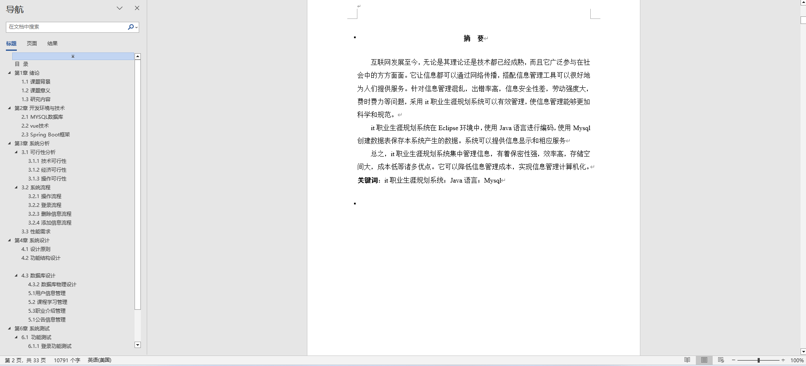
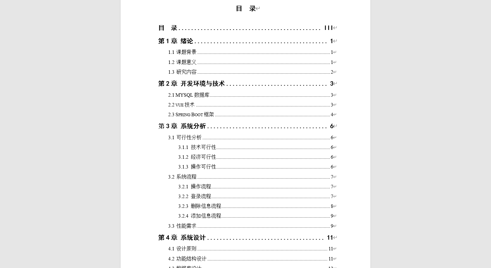
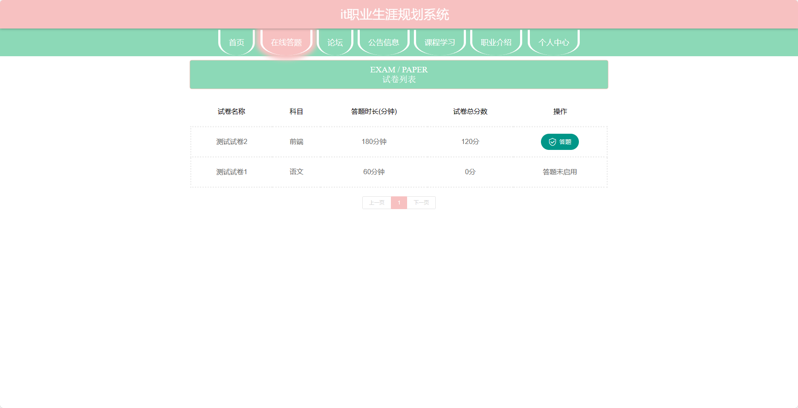
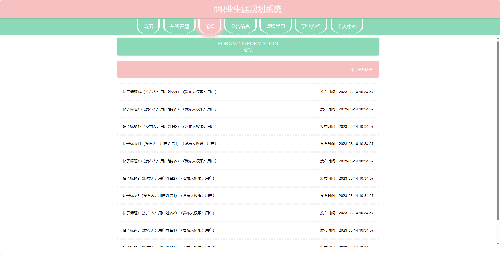
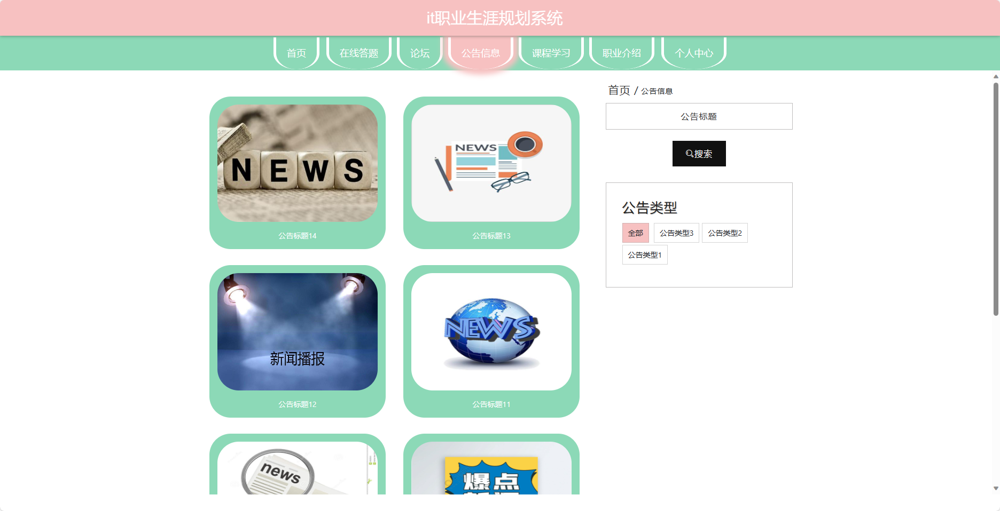
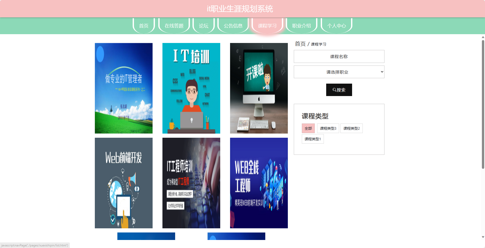
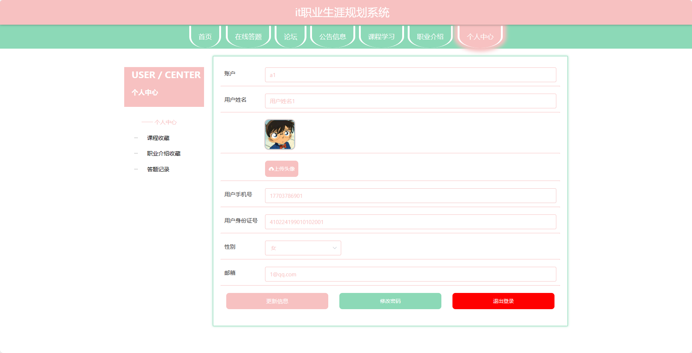
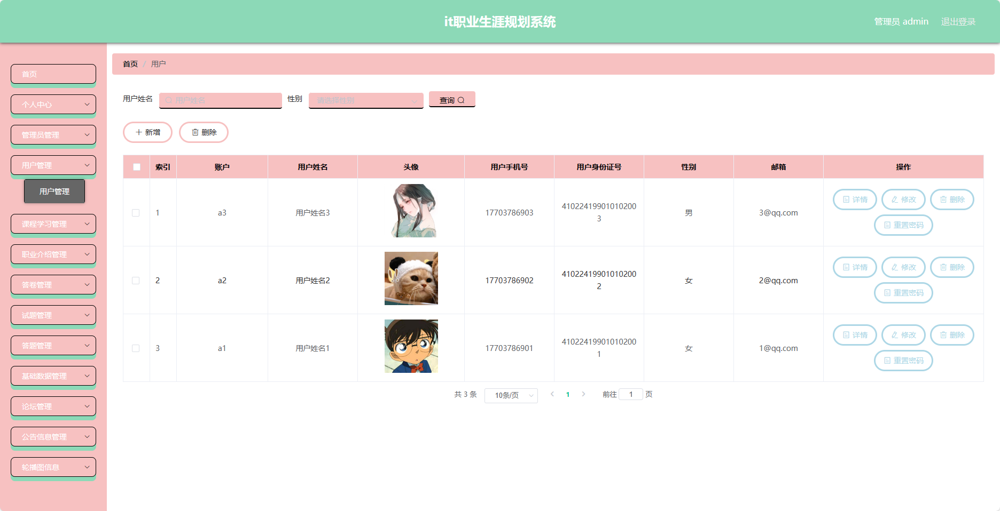
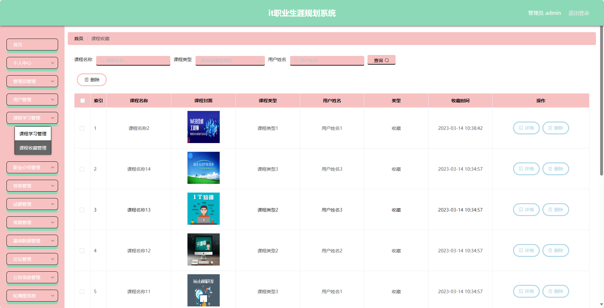

基于SpringBoot的it职业生涯规划系统（程序+论文）
=
- 完整代码获取地址：从戎源码网 ([https://armycodes.com/](https://armycodes.com/))
- 作者微信：19941326836  QQ：952045282 
- 承接计算机毕业设计、Java毕业设计、Python毕业设计、深度学习、机器学习
- 选题+开题报告+任务书+程序定制+安装调试+论文+答辩ppt 一条龙服务
- 所有选题地址https://github.com/nature924/allProject

一、项目介绍
---
基于Spring Boot框架实现的it职业生涯规划系统，系统包含两种角色：管理员、用户,系统分为前台和后台两大模块，主要功能如下。
### 【前台】：
- 首页：展示系统的概述和主要功能入口。
- 在线答题：提供在线的职业能力测试和题库。
- 论坛：用户可以在论坛上进行交流和讨论。
- 公告信息：管理员发布的系统公告和重要通知信息。
- 课程学习：提供职业技能学习的课程资源。
- 职业介绍：提供不同职业的介绍和相关信息。

### 【管理员】：
- 个人中心：管理员可以查看和编辑个人信息。
- 管理员管理：管理员可以对其他管理员进行管理，包括添加、编辑和删除管理员账号。
- 用户管理：管理员可以管理用户账号，包括查看用户信息、禁用用户账号等操作。
- 课程学习管理：管理员可以管理系统的课程学习模块，包括添加、编辑和删除课程。
- 职业介绍管理：管理员可以管理职业介绍模块，包括添加、编辑和删除职业介绍信息。
- 答卷管理：管理员可以查看用户的答卷记录和测试结果，进行统计和分析。
- 试题管理：管理员可以管理系统的试题库，包括添加、编辑和删除试题。
- 题管理：管理员可以管理试题的分类、标签等基础数据，包括添加、编辑和删除分类。
- 基础数据管理：管理员可以管理系统的基础数据，包括分类、标签等信息的添加、编辑和删除。
- 论坛管理：管理员可以管理论坛的帖子和评论，包括审核、删除等操作。
- 公告信息管理：管理员可以发布和管理系统的公告信息，包括添加、编辑和删除公告。
- 轮播图信息：管理员可以管理首页的轮播图信息，包括添加、编辑和删除轮播图。

二、项目技术
---
- 编程语言：Java
- 数据库：MySQL
- 项目管理工具：Maven
- 前端技术：VUE、HTML、Jquery、Bootstrap
- 后端技术：Spring、SpringMVC、MyBatis

三、运行环境
---
- 操作系统：Windows、macOS都可以
- JDK版本：JDK1.8以上都可以
- 开发工具：IDEA、Ecplise、Myecplise都可以
- 数据库: MySQL5.7以上都可以
- Tomcat：任意版本都可以
- Maven：任意版本都可以

四、运行截图
---
### 论文截图：

### 程序截图：

